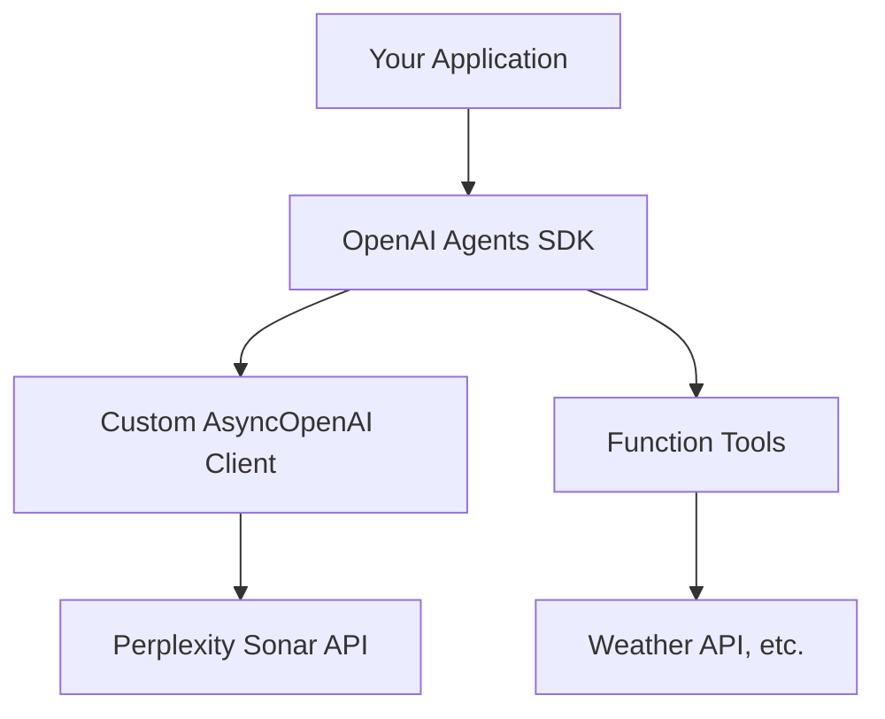

# Integrating Perplexity Sonar API with OpenAI Agents SDK

This comprehensive guide demonstrates how to integrate [Perplexity's Sonar API](https://sonar.perplexity.ai/) with the [OpenAI Agents SDK](https://github.com/openai/openai-agents-python) using a custom asynchronous client. You'll learn how to create intelligent agents that leverage Sonar's real-time search capabilities alongside OpenAI's agent framework.

## 🎯 What You'll Build

By the end of this guide, you'll have:
- ✅ A custom async OpenAI client configured for Sonar API
- ✅ An intelligent agent with function calling capabilities
- ✅ A working example that fetches real-time information
- ✅ Production-ready integration patterns

## 🏗️ Architecture Overview



This integration allows you to:
1. **Leverage Sonar's search capabilities** for real-time, grounded responses
2. **Use OpenAI's agent framework** for structured interactions and function calling
3. **Combine both** for powerful, context-aware applications

## 📋 Prerequisites

Before starting, ensure you have:

- **Python 3.7+** installed
- **Perplexity API Key** - [Get one here](https://docs.perplexity.ai/home)
- **OpenAI Agents SDK** access and familiarity

## 🚀 Installation

Install the required dependencies:

```bash
pip install openai nest-asyncio
```

:::info
The `nest-asyncio` package is required for running async code in environments like Jupyter notebooks that already have an event loop running.
:::

## ⚙️ Environment Setup

Configure your environment variables:

```bash
# Required: Your Perplexity API key
export EXAMPLE_API_KEY="your-perplexity-api-key"

# Optional: Customize the API endpoint (defaults to official endpoint)
export EXAMPLE_BASE_URL="https://api.perplexity.ai"

# Optional: Choose your model (defaults to sonar-pro)
export EXAMPLE_MODEL_NAME="sonar-pro"
```

## 💻 Complete Implementation

Here's the full implementation with detailed explanations:

```python
# Import necessary standard libraries
import asyncio  # For running asynchronous code
import os       # To access environment variables

# Import AsyncOpenAI for creating an async client
from openai import AsyncOpenAI

# Import custom classes and functions from the agents package.
# These handle agent creation, model interfacing, running agents, and more.
from agents import Agent, OpenAIChatCompletionsModel, Runner, function_tool, set_tracing_disabled

# Retrieve configuration from environment variables or use defaults
BASE_URL = os.getenv("EXAMPLE_BASE_URL") or "https://api.perplexity.ai"
API_KEY = os.getenv("EXAMPLE_API_KEY") 
MODEL_NAME = os.getenv("EXAMPLE_MODEL_NAME") or "sonar-pro"

# Validate that all required configuration variables are set
if not BASE_URL or not API_KEY or not MODEL_NAME:
    raise ValueError(
        "Please set EXAMPLE_BASE_URL, EXAMPLE_API_KEY, EXAMPLE_MODEL_NAME via env var or code."
    )

# Initialize the custom OpenAI async client with the specified BASE_URL and API_KEY.
client = AsyncOpenAI(base_url=BASE_URL, api_key=API_KEY)

# Disable tracing to avoid using a platform tracing key; adjust as needed.
set_tracing_disabled(disabled=True)

# Define a function tool that the agent can call.
# The decorator registers this function as a tool in the agents framework.
@function_tool
def get_weather(city: str):
    """
    Simulate fetching weather data for a given city.
    
    Args:
        city (str): The name of the city to retrieve weather for.
        
    Returns:
        str: A message with weather information.
    """
    print(f"[debug] getting weather for {city}")
    return f"The weather in {city} is sunny."

# Import nest_asyncio to support nested event loops
import nest_asyncio

# Apply the nest_asyncio patch to enable running asyncio.run() 
# even if an event loop is already running.
nest_asyncio.apply()

async def main():
    """
    Main asynchronous function to set up and run the agent.
    
    This function creates an Agent with a custom model and function tools,
    then runs a query to get the weather in Tokyo.
    """
    # Create an Agent instance with:
    # - A name ("Assistant")
    # - Custom instructions ("Be precise and concise.")
    # - A model built from OpenAIChatCompletionsModel using our client and model name.
    # - A list of tools; here, only get_weather is provided.
    agent = Agent(
        name="Assistant",
        instructions="Be precise and concise.",
        model=OpenAIChatCompletionsModel(model=MODEL_NAME, openai_client=client),
        tools=[get_weather],
    )

    # Execute the agent with the sample query.
    result = await Runner.run(agent, "What's the weather in Tokyo?")
    
    # Print the final output from the agent.
    print(result.final_output)

# Standard boilerplate to run the async main() function.
if __name__ == "__main__":
    asyncio.run(main())
```

## 🔍 Code Breakdown

Let's examine the key components:

### 1. **Client Configuration**

```python
client = AsyncOpenAI(base_url=BASE_URL, api_key=API_KEY)
```

This creates an async OpenAI client pointed at Perplexity's Sonar API. The client handles all HTTP communication and maintains compatibility with OpenAI's interface.

### 2. **Function Tools**

```python
@function_tool
def get_weather(city: str):
    """Simulate fetching weather data for a given city."""
    return f"The weather in {city} is sunny."
```

Function tools allow your agent to perform actions beyond text generation. In production, you'd replace this with real API calls.

### 3. **Agent Creation**

```python
agent = Agent(
    name="Assistant",
    instructions="Be precise and concise.",
    model=OpenAIChatCompletionsModel(model=MODEL_NAME, openai_client=client),
    tools=[get_weather],
)
```

The agent combines Sonar's language capabilities with your custom tools and instructions.

## 🏃‍♂️ Running the Example

1. **Set your environment variables**:
   ```bash
   export EXAMPLE_API_KEY="your-perplexity-api-key"
   ```

2. **Save the code** to a file (e.g., `pplx_openai_agent.py`)

3. **Run the script**:
   ```bash
   python pplx_openai_agent.py
   ```

**Expected Output**:
```
[debug] getting weather for Tokyo
The weather in Tokyo is sunny.
```

## 🔧 Customization Options

### **Different Sonar Models**

Choose the right model for your use case:

```python
# For quick, lightweight queries
MODEL_NAME = "sonar"

# For complex research and analysis (default)
MODEL_NAME = "sonar-pro"

# For deep reasoning tasks
MODEL_NAME = "sonar-reasoning-pro"
```

### **Custom Instructions**

Tailor the agent's behavior:

```python
agent = Agent(
    name="Research Assistant",
    instructions="""
    You are a research assistant specializing in academic literature.
    Always provide citations and verify information through multiple sources.
    Be thorough but concise in your responses.
    """,
    model=OpenAIChatCompletionsModel(model=MODEL_NAME, openai_client=client),
    tools=[search_papers, get_citations],
)
```

### **Multiple Function Tools**

Add more capabilities:

```python
@function_tool
def search_web(query: str):
    """Search the web for current information."""
    # Implementation here
    pass

@function_tool
def analyze_data(data: str):
    """Analyze structured data."""
    # Implementation here
    pass

agent = Agent(
    name="Multi-Tool Assistant",
    instructions="Use the appropriate tool for each task.",
    model=OpenAIChatCompletionsModel(model=MODEL_NAME, openai_client=client),
    tools=[get_weather, search_web, analyze_data],
)
```

## 🚀 Production Considerations

### **Error Handling**

```python
async def robust_main():
    try:
        agent = Agent(
            name="Assistant",
            instructions="Be helpful and accurate.",
            model=OpenAIChatCompletionsModel(model=MODEL_NAME, openai_client=client),
            tools=[get_weather],
        )
        
        result = await Runner.run(agent, "What's the weather in Tokyo?")
        return result.final_output
        
    except Exception as e:
        print(f"Error running agent: {e}")
        return "Sorry, I encountered an error processing your request."
```

### **Rate Limiting**

```python
import aiohttp
from openai import AsyncOpenAI

# Configure client with custom timeout and retry settings
client = AsyncOpenAI(
    base_url=BASE_URL, 
    api_key=API_KEY,
    timeout=30.0,
    max_retries=3
)
```

### **Logging and Monitoring**

```python
import logging

logging.basicConfig(level=logging.INFO)
logger = logging.getLogger(__name__)

@function_tool
def get_weather(city: str):
    logger.info(f"Fetching weather for {city}")
    # Implementation here
```

## 🔗 Advanced Integration Patterns

### **Streaming Responses**

For real-time applications:

```python
async def stream_agent_response(query: str):
    agent = Agent(
        name="Streaming Assistant",
        instructions="Provide detailed, step-by-step responses.",
        model=OpenAIChatCompletionsModel(model=MODEL_NAME, openai_client=client),
        tools=[get_weather],
    )
    
    async for chunk in Runner.stream(agent, query):
        print(chunk, end='', flush=True)
```

### **Context Management**

For multi-turn conversations:

```python
class ConversationManager:
    def __init__(self):
        self.agent = Agent(
            name="Conversational Assistant",
            instructions="Maintain context across multiple interactions.",
            model=OpenAIChatCompletionsModel(model=MODEL_NAME, openai_client=client),
            tools=[get_weather],
        )
        self.conversation_history = []
    
    async def chat(self, message: str):
        result = await Runner.run(self.agent, message)
        self.conversation_history.append({"user": message, "assistant": result.final_output})
        return result.final_output
```

## ⚠️ Important Notes

- **API Costs**: Monitor your usage as both Perplexity and OpenAI Agents may incur costs
- **Rate Limits**: Respect API rate limits and implement appropriate backoff strategies
- **Error Handling**: Always implement robust error handling for production applications
- **Security**: Keep your API keys secure and never commit them to version control

## 🎯 Use Cases

This integration pattern is perfect for:

- **🔍 Research Assistants** - Combining real-time search with structured responses
- **📊 Data Analysis Tools** - Using Sonar for context and agents for processing
- **🤖 Customer Support** - Grounded responses with function calling capabilities
- **📚 Educational Applications** - Real-time information with interactive features

## 📚 References

- [Perplexity Sonar API Documentation](https://docs.perplexity.ai/home)
- [OpenAI Agents SDK Documentation](https://github.com/openai/openai-agents-python)
- [AsyncOpenAI Client Reference](https://platform.openai.com/docs/api-reference)
- [Function Calling Best Practices](https://platform.openai.com/docs/guides/function-calling)

---

**Ready to build?** This integration opens up powerful possibilities for creating intelligent, grounded agents. Start with the basic example and gradually add more sophisticated tools and capabilities! 🚀 