# Bazaar-AI-Saathi(Specific to Indian Market)

BazaarAISaathi is an AI-powered platform designed to empower investors with actionable insights into the Indian stock market. Leveraging advanced natural language processing, real-time data analytics, and expert-driven financial modeling, the app delivers personalized investment strategies, market sentiment analysis, and portfolio optimization recommendations.
https://github.com/mahanteshimath/BazaarAISaathi/raw/main/src/App_Architecture.jpg


## How It Uses the Sonar API

Bazaar-AI-Saathi integrates with [Perplexity Sonar Pro](https://docs.perplexity.ai), leveraging advanced features for domain-specific search and rich responses:
1. **Indian Stock Market**

   * Examples: “All Listed Stocks”, “Finance with Perplexity”, “Today’s Market”
   * Used for macro analysis, trend detection, market reasoning.
2. **Stock Analysis**

   * Examples: “Techno-Funda Analysis”, “Deep Research”, “Tip Tester”
   * LangChain agent uses these to run fundamental/technical analysis and validate tips.
3. **Portfolio**

   * Examples: “Portfolio analysis and Optimization”, “Financial Independence”
   * Models help optimize user portfolios and generate FIRE plans.

Each of these feeds into the **Sonar API models** to get reasoning, analysis, and predictions.

#### 🔸 List of Sonar API Models:

* `sonar-deep-research`
* `sonar-reasoning-pro`
* `sonar-reasoning`
* `sonar-pro`
* `sonar`

# Links

- Youtube:https://youtu.be/5t2ldWS3SJ8
- GitRepo:https://github.com/mahanteshimath/BazaarAISaathi
- Architecture:https://github.com/mahanteshimath/BazaarAISaathi/raw/main/src/App_Architecture.jpg

## Flow daigram

```mermaid
flowchart TD
    %% User Interface Layer
    subgraph "User Interface Layer"
        direction TB
        Home["Home.py"]:::ui
        Architecture["Architecture.py"]:::ui
        DeepResearch["Deep_Research.py"]:::ui
        RealTimeData["Fetch_real_time_stock_data.py"]:::ui
        AIResearch["Finance_with_Perplexity.py"]:::ui
        FinancialIndependence["Financial_Independence.py"]:::ui
        Hypothesis["Hypothesis.py"]:::ui
        MarketIndicators["Market_Indicators.py"]:::ui
        PortfolioAnalysisPage["Portfolio_Analysis.py"]:::ui
        StocksList["Stocks_List.py"]:::ui
        TechnoFund["Techno_Fund_Analysis.py"]:::ui
        TipTester["Tip_Tester.py"]:::ui
    end

    %% Business Logic Layer
    subgraph "Business Logic Layer"
        direction TB
        RTStock["RealTime_stock_price_analysis.py"]:::logic
        DeepResearchLogic["deep_research.py"]:::logic
        MarketInsights["get_market_insights.py"]:::logic
        FinanceUtils["finance_utils.py"]:::logic
        PortfolioLogic["portfolio_analysis.py"]:::logic
        FIREPlanner["fire_planner.py"]:::logic
        TipAnalysis["tip_analysis.py"]:::logic
    end

    %% Data Layer
    subgraph "Data Layer"
        direction TB
        BSE["BSE_Equity.csv"]:::data
        NSE["NSE_EQUITYS.csv"]:::data
        Holdings["holdings.csv"]:::data
        Books["Top50Books.csv"]:::data
        ArchAsset["Architecture_app.txt"]:::data
    end

    %% External Services
    subgraph "External Services"
        direction TB
        StockAPI["Stock Price API"]:::external
        PerplexityAI["Perplexity AI / LangChain"]:::external
        EasyOCR["EasyOCR / DocParser"]:::external
        StreamlitSecrets["Streamlit Secrets"]:::external
    end

    %% Flows: UI to Logic
    Home -->|navigates to| Architecture
    Home -->|navigates to| DeepResearch
    Home -->|navigates to| RealTimeData
    Home -->|navigates to| AIResearch
    Home -->|navigates to| FinancialIndependence
    Home -->|navigates to| Hypothesis
    Home -->|navigates to| MarketIndicators
    Home -->|navigates to| PortfolioAnalysisPage
    Home -->|navigates to| StocksList
    Home -->|navigates to| TechnoFund
    Home -->|navigates to| TipTester

    RealTimeData -->|calls| RTStock
    DeepResearch -->|calls| DeepResearchLogic
    AIResearch -->|calls| MarketInsights
    PortfolioAnalysisPage -->|calls| PortfolioLogic
    FinancialIndependence -->|calls| FIREPlanner
    Hypothesis -->|calls| FinanceUtils
    MarketIndicators -->|calls| FinanceUtils
    StocksList -->|calls| FinanceUtils
    TechnoFund -->|calls| FinanceUtils
    TipTester -->|calls| TipAnalysis

    %% Logic to Data/External
    RTStock -->|fetches JSON| StockAPI
    RTStock -->|processes data| FinanceUtils

    DeepResearchLogic -->|scrapes & processes| Books
    DeepResearchLogic -->|AI call| PerplexityAI

    MarketInsights -->|sends data| PerplexityAI

    FinanceUtils -->|reads CSV| BSE
    FinanceUtils -->|reads CSV| NSE

    PortfolioLogic -->|reads CSV| Holdings
    FIREPlanner -->|reads CSV| Holdings

    TipAnalysis -->|OCR image| EasyOCR
    TipAnalysis -->|AI validation| PerplexityAI

    %% Return flows
    RTStock -->|DataFrame| RealTimeData
    DeepResearchLogic -->|text/DataFrame| DeepResearch
    MarketInsights -->|insights| AIResearch
    FinanceUtils -->|DataFrame| Hypothesis
    FinanceUtils -->|DataFrame| MarketIndicators
    PortfolioLogic -->|analysis| PortfolioAnalysisPage
    FIREPlanner -->|plan| FinancialIndependence
    TipAnalysis -->|result| TipTester

    %% Click Events
    click Home "https://github.com/mahanteshimath/bazaaraisaathi/blob/main/Home.py"
    click Architecture "https://github.com/mahanteshimath/bazaaraisaathi/blob/main/pages/Architecture.py"
    click DeepResearch "https://github.com/mahanteshimath/bazaaraisaathi/blob/main/pages/Deep_Research.py"
    click RealTimeData "https://github.com/mahanteshimath/bazaaraisaathi/blob/main/pages/Fetch_real_time_stock_data.py"
    click AIResearch "https://github.com/mahanteshimath/bazaaraisaathi/blob/main/pages/Finance_with_Perplexity.py"
    click FinancialIndependence "https://github.com/mahanteshimath/bazaaraisaathi/blob/main/pages/Financial_Independence.py"
    click Hypothesis "https://github.com/mahanteshimath/bazaaraisaathi/blob/main/pages/Hypothesis.py"
    click MarketIndicators "https://github.com/mahanteshimath/bazaaraisaathi/blob/main/pages/Market_Indicators.py"
    click PortfolioAnalysisPage "https://github.com/mahanteshimath/bazaaraisaathi/blob/main/pages/Portfolio_Analysis.py"
    click StocksList "https://github.com/mahanteshimath/bazaaraisaathi/blob/main/pages/Stocks_List.py"
    click TechnoFund "https://github.com/mahanteshimath/bazaaraisaathi/blob/main/pages/Techno_Fund_Analysis.py"
    click TipTester "https://github.com/mahanteshimath/bazaaraisaathi/blob/main/pages/Tip_Tester.py"
    click RTStock "https://github.com/mahanteshimath/bazaaraisaathi/blob/main/utils/RealTime_stock_price_analysis.py"
    click DeepResearchLogic "https://github.com/mahanteshimath/bazaaraisaathi/blob/main/utils/deep_research.py"
    click MarketInsights "https://github.com/mahanteshimath/bazaaraisaathi/blob/main/utils/get_market_insights.py"
    click FinanceUtils "https://github.com/mahanteshimath/bazaaraisaathi/blob/main/utils/finance_utils.py"
    click PortfolioLogic "https://github.com/mahanteshimath/bazaaraisaathi/blob/main/utils/portfolio_analysis.py"
    click FIREPlanner "https://github.com/mahanteshimath/bazaaraisaathi/blob/main/utils/fire_planner.py"
    click TipAnalysis "https://github.com/mahanteshimath/bazaaraisaathi/blob/main/utils/tip_analysis.py"
    click BSE "https://github.com/mahanteshimath/bazaaraisaathi/blob/main/src/BSE_Equity.csv"
    click NSE "https://github.com/mahanteshimath/bazaaraisaathi/blob/main/src/NSE_EQUITYS.csv"
    click Holdings "https://github.com/mahanteshimath/bazaaraisaathi/blob/main/src/holdings.csv"
    click Books "https://github.com/mahanteshimath/bazaaraisaathi/blob/main/src/Top50Books.csv"
    click ArchAsset "https://github.com/mahanteshimath/bazaaraisaathi/blob/main/src/Architecture_app.txt"

    %% Styles
    classDef ui fill:#cce5ff,stroke:#004085,color:#004085;
    classDef logic fill:#d4edda,stroke:#155724,color:#155724;
    classDef data fill:#ffeeba,stroke:#856404,color:#856404;
    classDef external fill:#d6d8db,stroke:#1b1e21,color:#1b1e21;
```


## Overview
BazaarAISaathi is an AI-powered platform designed to empower investors with actionable insights into the Indian stock market. Leveraging advanced natural language processing, real-time data analytics, and expert-driven financial modeling, the app delivers personalized investment strategies, market sentiment analysis, and portfolio optimization recommendations.

## 🚀 Key Features
- 🧮 **Financial Independence Planner (FIRE):** Create detailed, personalized plans for financial independence using inputs like age, salary, marital status, and more.
- 📝 **Investment Advice Tester:** Submit investment tips via text or image. The app extracts text (using EasyOCR) and provides AI-driven analysis and validation.
- 📊 **Fundamental & Technical Analysis:** Access comprehensive reports on company fundamentals, technical indicators, market sentiment, and trading strategies.
- 📈 **Portfolio Analysis:** Upload or paste your portfolio for in-depth, multi-dimensional analysis and stock-wise recommendations.
- 🔍 **Market Research & Competitor Benchmarking:** Use AI-driven research to assess industry trends, compare competitors, and identify new opportunities.
- 📉 **Deep Market Insights:** Stay updated with real-time indicators such as top gainers/losers, macroeconomic trends, and critical market data.
- ⏱️ **Real-Time Stock Data:** Fetch and analyze live stock prices and trends for informed decision-making.
- 🧪 **Hypothesis Testing:** Test investment hypotheses using historical and real-time data.
- 💭 **Ask Finance Questions:** Get expert answers to any finance-related queries using advanced AI technology.
- 📚 **Investment Books Summary:** Access concise summaries of top 50 investment books for quick learning and reference.


## 🛠️ Technologies Used
- **Streamlit:** Interactive web app framework.
- **Perplexity AI & LangChain:** Advanced NLP and financial forecasting.
- **Pandas, Plotly, BeautifulSoup:** Data manipulation and visualization.
- **EasyOCR & Docling Parse:** Text extraction from images and PDFs.
- **Python Ecosystem:** Including requests, python-dotenv, and more.

## ⚡ Installation & Setup
1. **Clone the Repository:**
   ```powershell
   git clone https://github.com/yourusername/BazaarAISaathi.git
   cd BazaarAISaathi
   ```
2. **Install Dependencies:**
   ```powershell
   pip install -r requirements.txt
   ```
3. **Configure API Keys:**
   - Set up your Streamlit secrets and API keys (Perplexity, etc.) in a `secrets.toml` file.
4. **Run the App:**
   ```powershell
   streamlit run Home.py
   ```
   - Or run any specific module from the `pages/` directory, e.g.:
   ```powershell
   streamlit run pages/Financial_Independence.py
   ```

## 📁 File Structure
```plaintext
├── Home.py
├── README.md
├── requirements.txt
├── pages
│   ├── Architecture.py
│   ├── Deep_Research.py
│   ├── Fetch_real_time_stock_data.py
│   ├── Finance_with_Perplexity.py
│   ├── Financial_Independence.py
│   ├── Hypothesis.py
│   ├── Market_Indicators.py
│   ├── Portfolio_Analysis.py
│   ├── Stocks_List.py
│   ├── Techno_Fund_Analysis.py
│   └── Tip_Tester.py
├── src
│   ├── Architecture_app.txt
│   ├── BSE_Equity.csv
│   ├── holdings.csv
│   ├── India.jpeg
│   ├── NSE_EQUITYS.csv
│   └── Top50Books.csv
├── utils
│   ├── deep_research.py
│   ├── finance_utils.py
│   ├── fire_planner.py
│   ├── get_market_insights.py
│   ├── portfolio_analysis.py
│   ├── RealTime_stock_price_analysis.py
│   └── tip_analysis.py
```